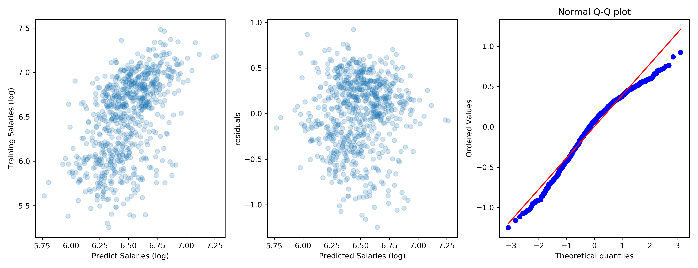

# **Predicting MLB Salaries**

## Jason Salazer-Adams

## **Introduction**

The data utilized in this project was rookie year baseball data scraped from [Baseball Reference](https://www.baseball-reference.com/) between 1985-2017. The data were then further reduced down to only batters, and those batters who had at least 6 years of MLB service. The goal of the project was to predict year 6 salary by only utilizing rookie year traditional offensive statistics. The salary prediction could then be utilized to help team management effectively negotiate contracts with rookies in year 3 or 4, instead of risking a departure of a top rookie to free agency after year 6.

## **Methodology**

The sample data set contained 919 players and a random train/test split of 80/20 was performed to measure the accuracy of the trained model.  

### **Features**

The feature set consisted of all traditional offensive statistics, plus the age of the player during the rookie season.

|Feature|Description
|---|---|
|HR |Home runs|
|H |Hits|
|R |Runs|
|SB |Stolen Bases|
|TB |Total Bases|
|2B |Doubles|
|3B |Triples|
|RBI |Runs batted in|
|BB |Walks|
|SO |Strike outs|
|G |Games|
|PA |Plate appearences|
|AB |Official at bats|
|age |Age during rookie year|

### **Tranformations / Feature Engineering**

The salary data was collected over multiple decades and was transformed into today's dollars using the [cpi](https://github.com/datadesk/cpi) python library. Salary data in general tends to be heavily skewed right, and thus the adjusted salary in today's dollars was log transformed.

Log or Box-Cox transformations of the feature set was explored. However, the model accuracy in the training data set did not significantly improve compared to a model without feature transformation, thus no log or Box-Cox transfromations were performed.

I did find standard scaling the feature set was beneficial to the accuracy of the model, and thus was included during the model selection process.

Lastly, adding polynomial features to fit non-linear relationshipe between feature and response were added to the model.

### **Cross-Validation**

The training data set was cross-validated utilizing 10-fold cross validation for each model parameter. Multiple models were considered and the model selection was performed with MSE. The table below summarizes the models explored.

|Rank |Model |Polynomial Deg.| Lambda| MSE |
---|---|---|---|---
|0 |Lasso |3 |0.01 |0.161218
|1 |Lasso |2 |0.01 |0.161348
|2 |Lasso |4 |0.01 |0.161483
|3 |Lasso |5 |0.01 |0.162328
|4 |Lasso |NA |0.01 |0.162541
|5 |Linear |NA | NA|0.163087

### **Best Model**

The best model selected was a Lasso model with 3rd degree polynomial. Below is a plot showing the quality of fit of the best model with the training data set.

There is still significant amount of variance left in the model and in particular you can see the tails causes issues with the accuracy of the model. Overall, the R2 and RMSE values for train, test, and entire sample are presented below.

|Data |R2 |RMSE (log $'s) |
---|---|---|
Train |0.273 |0.393
Test |0.266 |0.386
Full |0.276 |0.391

## **Results**

The model definitely has room for improvement as the R2 indicates there is still variance which theortically could be further explained by an unknown feature. However, the model does show there is a statistically significant signal from utilizing traditional hitting statistics. The model could be further enhanced by exploring these three main areas,

* Include new saber metric / statcast statistics as features in the model, e.g. WAR, exit velocity, launch angle, etc.  
* Segment the data by position. Typically, Catchers or Shortstops do not necessairly have as high traditional hitting statistics compared to Outfielders or First basemen, and thus could cause conflating signals when attempting to predict salaries.  
* Include the first 2 years of a player's career, instead of just the first year. There isn't much history, if at all, of a player receiving a contract after their rookie year. Including multiple years of data could potentially smooth out erratic rookie performance in first or second year of their career.

## **Tools**

I utilized the following tools for my analysis.

* Python
  * Data storage/acquistion: BeautifulSoup, selenium, pandas, numpy
  * Data Analysis: sklearn, scipy, cpi
  * Visualization: seaborn, matplotlib
* Keynote
  * Google image search for slide design

## **What I would consider differently?**

I started off with a bold question, can the performance in a rookie year predict value in year 6? I simplified the question and added bias to the model by only looking at players who played for at least 6 years. A question that wasn't addressed was how to determine a current rookie will continue to be playing in the MLB at year 6. Fundamentally, the scope of the question was rather large. Next time I would like to work on better defining a smaller scope for a 2 week project, and then expand scope as time permits.

Additionally, I felt I spent a lot of time aquiring data and tuning the model. In hindsight, I would have liked to spent more time critcally thinking if there would be any feature engineering which could have been done to improve the model rather, than simply using the traditional offensive statistics.
